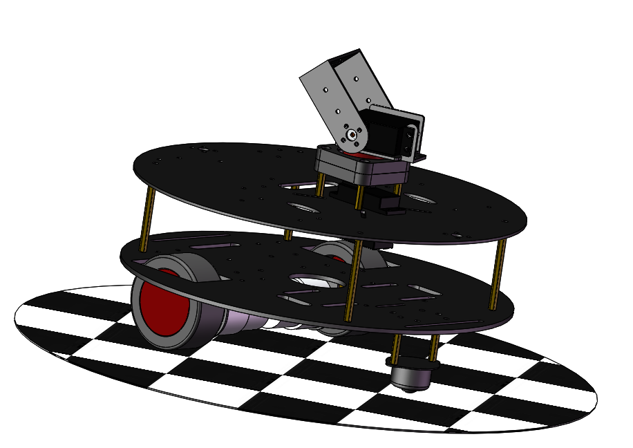

# PyEspCar - 基于MicroPython-ESP32的WIFI小车

**1Z实验室出品**
**1ZLAB**： **Make Things Easy**

## 项目简介

基于MicroPython-ESP32的小车， 可以通过WIFI远程控制，电机自带高精度编码器， 通过PID进行转速控制与位置控制.  附带运动学分析, 控制小车前进速度还有旋转方向,  逆运动学解推算小车当前的位姿.

1ZLab在准备挑选合适的小车来研发计算机视觉的教程时候 , 发现习惯了Python语法的我们, 在市面上找不到合适小车, 后来我们选了ESP32作为小车的控制主板, 可以使用Python对其进行交互式编程, 极大的提升了开发效率.

下图是我们的**PyESPCar V2.1**版本的实物图, 舵机云台上面挂载了手机, 可以通过手机WIFI传图, 然后在PC上用OpenCV做图像处理, 然后PC发送控制指令给PyESPCar WIFI小车. 

> 小车采用预售的模式, 购买小车联系1Z实验室阿凯  
> QQ： 244561792
> 微信：xingshunkai

## 小车自身特性

* MicroPython编程，小车通过repl交互式编程

* **高精度小车转速与转角控制** 自带AB相编码器，采用四倍频技术，电机旋转一圈可以获取**1320个脉冲**。从而可以更精确的控制小车的旋转角度与转速。

* **远程调试**，通过WebREPL，可以远程给小车进行编程，修改PID参数，上传/同步代码文件。

* 软件硬件与机械结构全部**开源(Open Source)**。

  不用购买之后再提供，直接放在Github上，后续再配套教程持续制作用户友好的**文档**

* **配套教程**  制作PyEspCar Z1的视频教程（讲micropython-esp32与运动控制），发布在**Bilibili**上面， 内容可以参考下文的 `MicroPython-ESP32教学`与 `自控与运动学控制` 这两部分。

  B站主页： https://space.bilibili.com/40344504/#/

* **代码规范**，逐行注释，容易看懂， 参见代码仓库。

* 自主研发**ESP32 Web IDE**， [IDE地址](http://dev.1zlab.com)

## 机械结构与硬件

* **轻量级二自由度云台**

  

  更适合放在小车上面，同时末端可以承受较大负载（例如手机）。

  高品质20KG 数字舵机， 后期可以拓展为机械臂。

  

* **PyESPCar 小车底板** 

  

  

  填补了目前ESP32小车底板的空白，主控采用安信可公司的NodeMCU32s，直插在小车底板上。

  板子预留资源如下: 

  *  用户按键 ×1
  *  电机与AB相编码器接口 ×2
   *  传感器接口×2  
   *  UART串口x2  
   *  I2C接口 x1（两个I2C插口）

  

* **全金属双层小车底板**  材质选用铝合金，比亚克力更坚固， 尺寸比一般的两轮差速小车大270mm。

  底板上面也预留了**数莓派**，二自由度云台，电池，超声波，ESP32小车控制板,还有**激光雷达**的孔位。

* **高精度小车编码器**  电机选用JBG37-520，减速比**1:30**, 电机力距大。 

  自带AB相编码器，采用四倍频技术，电机旋转一圈可以获取**1320个脉冲**。从而可以更精确的控制小车的旋转角度与转速。

* **12V电池组，电池容量6000毫安时**， 配套充电器, 调试一天不用充电.

物料成本列表见： [PyESPCar配件清单+物料成本核算-V2](https://github.com/1zlab/1ZLAB_PyEspCar/blob/master/hardware/PyESPCar-Z1-%E9%85%8D%E4%BB%B6%E6%B8%85%E5%8D%95%2B%E7%89%A9%E6%96%99%E6%88%90%E6%9C%AC%E6%A0%B8%E7%AE%97.md)

## Course1: MicroPython-ESP32教学计划

[MicroPython-ESP32基础入门-1Z实验室出品](https://github.com/1zlab/1ZLAB_MicroPython_ESP32_Tutorial)

结合小车讲解单片机基础，用MicroPython来控制单片机。

学会如何控制小车的同时，也完成了单片机入门。另外，因为ESP32开发板自带WIFI，所以ESP32开发板也可以进行物联网IOT的开发。

| 组件         | 相关知识点                                                   |
| ------------ | ------------------------------------------------------------ |
| 电池采样     | ADC采样，Timer定时器轮巡，防止电池过放                       |
| 用户按键     | GPIO输入                                                     |
| 电机驱动     | GPIO输出，PWM，电机驱动的使用，Timer定时器                   |
| AB相编码器   | IRQ外部中断， AB相四倍频计数原理（电机旋转一圈1480个脉冲），位运算 |
| 二自由度云台 | PWM，Servo舵机控制， (如果小车搭载机械臂 -> I2C通信 舵机控制板的使用) |
| 串口液晶屏   | UART串口通信，给小车编写一个触屏的GUI界面（使用HMI串口液晶屏） |
| 加速度传感器 | I2C通信/UART                                                 |
| WIFI         | WIFI连接， HTTP通信， Socket通信（TCP ， UDP）利用WIFI远程调参，远程上传代码 |
|              |                                                              |

## Course2: 自控与运动学控制教学计划
使用Python（MicroPython-ESP32）结合实际项目（小车）讲解两轮差速小车的控制。

* PID控制电机旋转角度
* PID控制电机旋转速度
* 两轮差速小车运动学控制
* 小车旋转角度控制
* 小车整体速度控制
* PID控制舵机云台
* 加速度传感器，惯性导航系统（可以与编码器进行信息融合）

**视频教学 + 调参上位机（可通过WIFI调参）**

## Course3: 计算机视觉综合教学计划

结合OpenCV计算机视觉完成特定的任务。
>有了小车的硬件平台， 后面拓展结合OpenCV项目就比较容易，后续的视频课程都围绕这个来做。

1. 小车色块追踪， 追着特定颜色的小球跑。
2. 小车巡线，讲解滤波算法 
3. 增强现实码ArucoTag追踪 

## 贡献者(Ccontributor)

**特别感谢魏彦峰同学在机械结构设计还有小车控制板设计做出的贡献。**

* [魏彦峰-1Z实验室&中国地质大学（武汉）](https://github.com/rose-w)
* [邢顺凯-1Z实验室&杭州电子科技大学](https://github.com/mushroom-x)
* [吴彬聪-1Z实验室&杭州电子科技大学](https://github.com/littleoniononion)
* [刘新宇-廊坊师范](https://github.com/LiuXinyu12378)
* [杨子豪-平衡小车之家](http://minibalance.com/)

## 加入1Z实验室

出品：1Z实验室 （1ZLAB： Make Things Easy）

1Z实验室 Make Things Easy . 致力于在机器人+计算机视觉+人工智能的重叠区域, 制作小白友好的教程.

